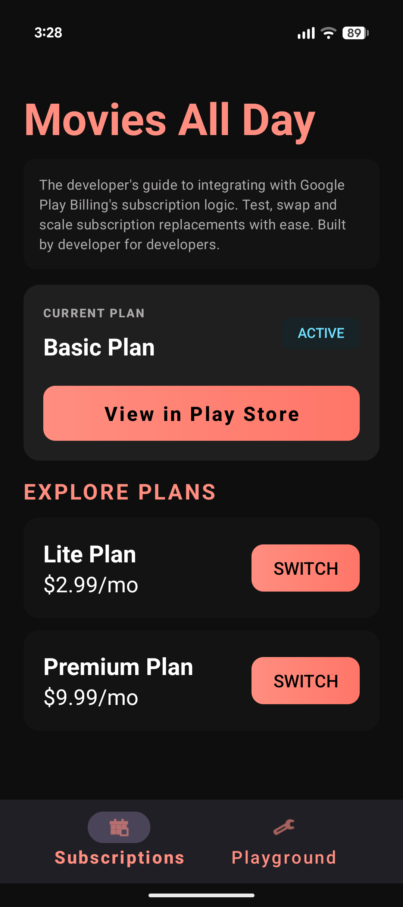
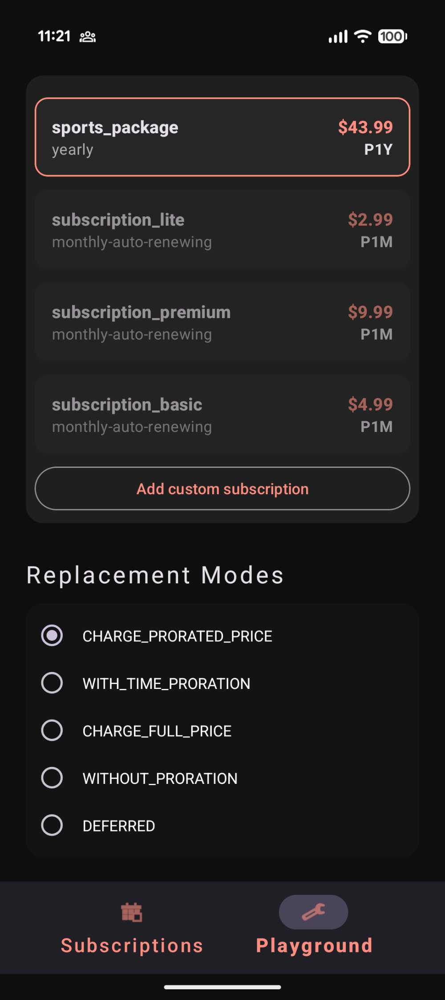
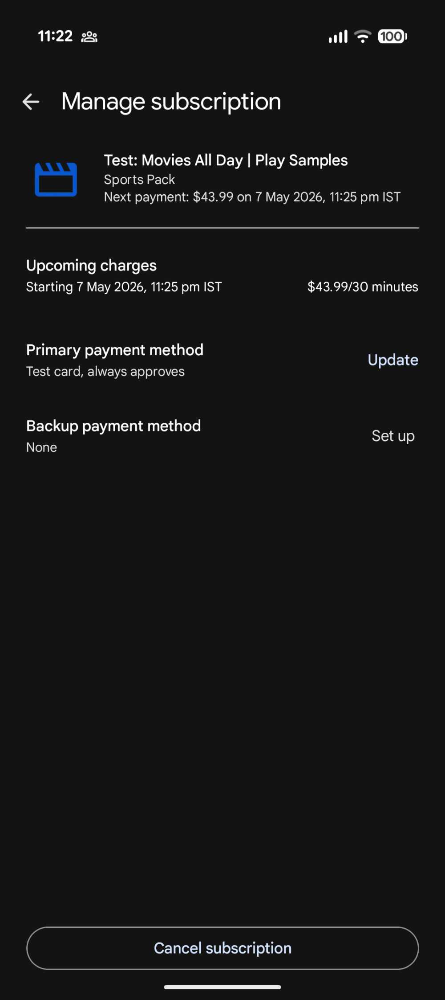

# Movies All Day | Play Samples

Movies All Day is a sample app that demonstrates how to integrate subscription
replacements using the Play Billing Library. It provides practical examples for
handling upgrades, downgrades, and the various replacement modes, ensuring a
seamless transition between different subscription plans. This is a sample
application and is intended to be used only as a reference for developers.

## Features

This app demonstrates the following:

*   How to query subscription products configured in your Google Play Console
*   How to query a user's active subscription purchases
*   How to launch the billing flow to initiate a subscription replacement

The **Replacement Playground** feature in the sample app lets you test
subscription upgrades and downgrades for the subscription products configured in
your Google Play Console.

## Screenshots

| Sample app main screen | Replacement Playground | Subscription plan changes in Play Store |
| :---: | :---: | :---: |
|  |  |  |

## Codelab

To learn more about how to configure subscriptions in the Google Play
Console, build and test this sample app, and process Subscription Replacements,
refer to the codelab: [Implement Subscription replacements with Google Play
Billing](https://codelabs.developers.google.com/play-billing-subs-replacement).

## Contributing

Please read our [contributing guidelines](../CONTRIBUTING.md) before submitting
pull requests.

## License

This project is licensed under the Apache 2.0 License - see the
[LICENSE](../LICENSE) file for details.